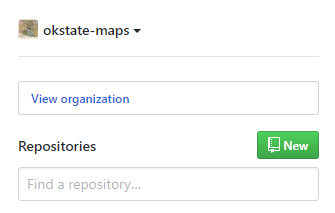
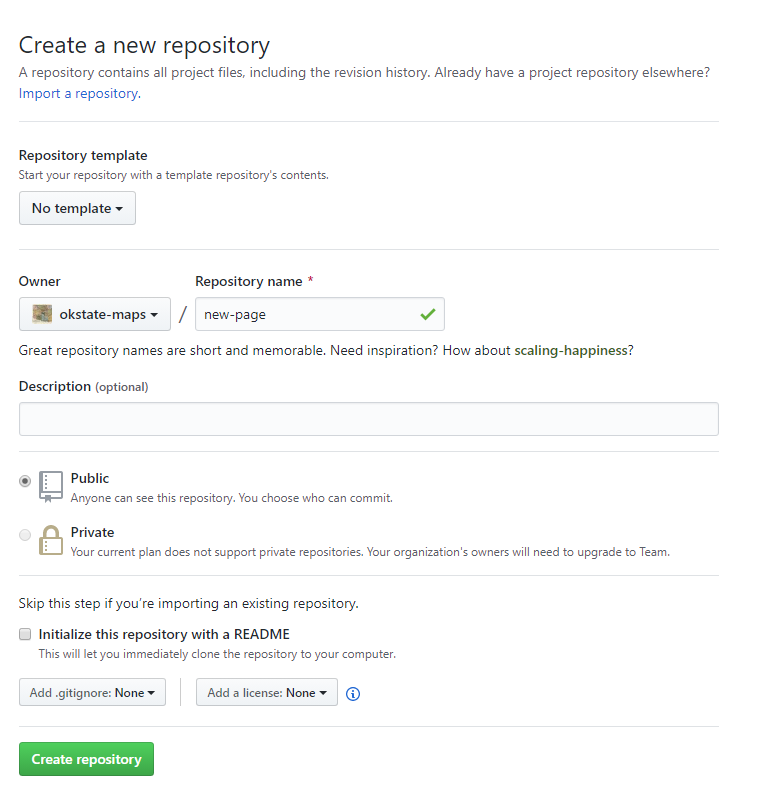
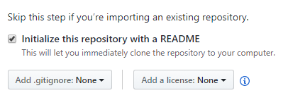
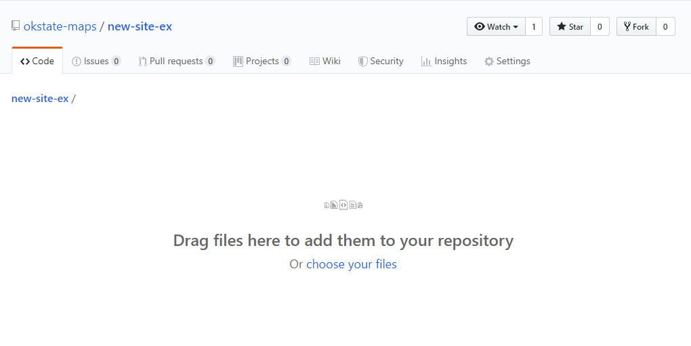
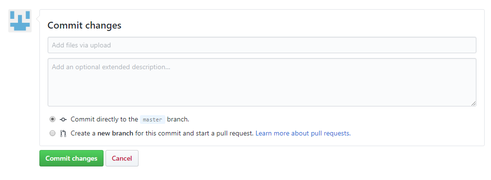
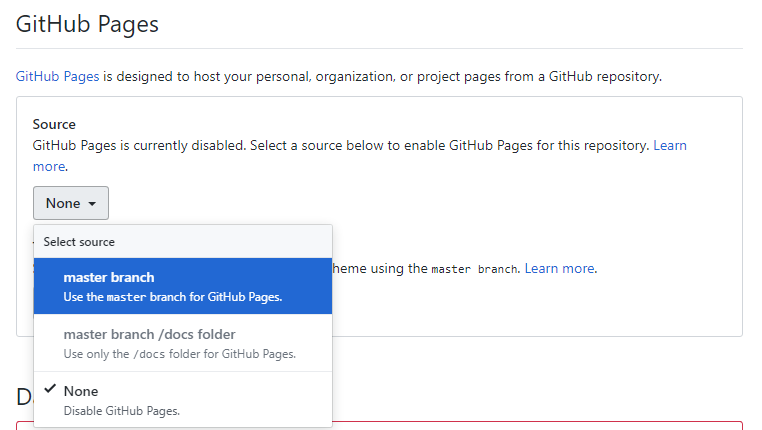
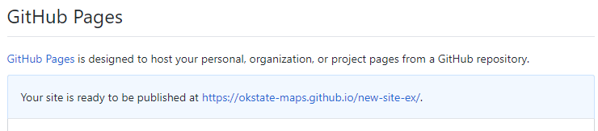

## About
Last Updated *[09/11/2019]*   
Created by [OSU Maps and Spatial Data](https://info.library.okstate.edu/map-room)

## Table of Contents
- Introduction 
- *Hosting a Website on Github*
- Conclusion
- Further Reading/Resources

## Introduction
GitHub Pages can be used to create simple website pages using Markdown, but it can also host more complex websites by allowing users to upload their own files. Follow these simple steps to host your very own website!

## *Hosting a Website using Github Pages*
1. To get started, log on to your Github account.
2. In the lefthand side of the page, there is a pannel that holds previously created pages and allows you to create new ones. Select *New*.

3. Give the file a name and make sure it is being created in the correct owner account if you have joint accounts.

4. Towards the bottom of this page, be sure to check the box next to *Initialize...*

5. Now click the *Create repository* button.

6. Once the repository is created, we should add our files. Click *Upload* on the toolbar.

7. Next, drag and drop your files into the allotted area. 

8. Be sure to click *Commit changes* after any changes are made or they will be lost. 

9. In order to make your website visible to others, we will need to change some of the settings. 

10. Scroll down towards the bottom of the page to locate the GitHub Pages section. Change the *source* to *master branch*.

11. The page will refresh and a website link will show up in the GitHubPages section. This is the link to your newly created website. 

12. If you realize you need to update your site once your files are uploaded, you can do this in just a few steps. Just click *Edit*, make any necessary changes, and don't forget to commit the changes!

## Conclusion
GitHub Pages make it so easy to host your very own website creations! Following the above steps will ensure a successful website hosting experience.
## Further Reading/Resources

[Return to Top](#about)
